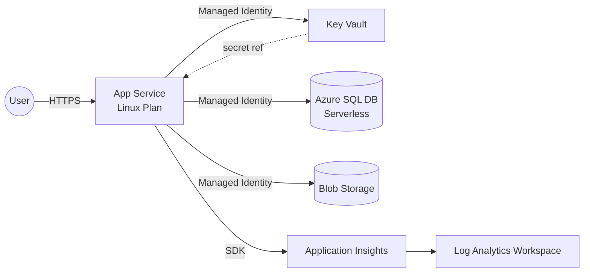

# Step 1: プロンプトで設計図を作る

このステップでは、「作りたいアプリケーションの要件」を GitHub Copilot Chat に渡して、**Azure 上のアーキテクチャ設計図 (Mermaid)** を生成します。

---

## 🎯 このステップのゴール

- 要件を構造化してプロンプトにできる
- Copilot に **Mermaid 形式** のアーキテクチャ図を出力させられる
- 出力された設計図を **レビュー・修正** するコツがわかる

---

## 1. なぜ「設計図」から始めるのか

いきなり Bicep を書かせると、Copilot は「それっぽいけれど要件に合っていない」コードを生成しがちです。

- リソース間の依存関係が曖昧
- ネットワーク / ID / シークレット管理の方針がブレる
- 環境分離 (dev / prod) の考慮が抜ける

**先にアーキテクチャ図を生成し、人間がレビューして合意してから Bicep に落とす** ことで、成果物の品質が大きく安定します。これは AI を使う / 使わないに関わらず、IaC の鉄則です。

---

## 2. プロンプトの型

良いプロンプトは以下の 4 要素を含みます。

| 要素 | 例 |
|------|------|
| **役割 (Role)** | あなたは Azure ソリューションアーキテクトです |
| **コンテキスト (Context)** | 社内向けの小規模な Web アプリを Azure にデプロイしたい |
| **要件 (Requirements)** | App Service + SQL + Key Vault ... / 東日本リージョン / dev・prod 分離 |
| **出力形式 (Output)** | Mermaid `flowchart LR` 形式 + 各リソースの役割説明 |

---

## 3. サンプルプロンプト

以下を **VS Code の Copilot Chat** にそのまま貼り付けて実行してみてください。

> 完全版は [`prompts/01-design.prompt.md`](../prompts/01-design.prompt.md) にあります。

````text
あなたは Azure ソリューションアーキテクトです。
以下の要件を満たす Web アプリケーション基盤の最小構成を設計してください。

# 要件
- 小規模な社内 Web アプリ (Node.js または .NET)
- データストアは Azure SQL Database (Serverless)
- シークレットは Azure Key Vault で一元管理し、App Service からは Managed Identity で参照
- アプリのログ / メトリクスは Application Insights と Log Analytics に集約
- ファイルアップロード用に Blob Storage を用意
- 本番 (prod) と開発 (dev) の 2 環境をパラメータで切り替えられるようにする
- リージョンは Japan East

# 非機能要件
- パスワードレス (Managed Identity + RBAC) を優先
- 最小権限の原則に従う
- Azure Well-Architected Framework の信頼性・セキュリティ・運用性を意識

# 出力形式
1. アーキテクチャ概要 (箇条書き 5 行以内)
2. Mermaid の `flowchart LR` 記法でアーキテクチャ図
3. 各リソースの役割と、採用した理由を表形式で
4. 想定されるリスクと対策を 3 点

※ コード (Bicep) はまだ書かなくてよいです。設計のみ。
````

---

## 4. 期待される出力例

Copilot は以下のような Mermaid 図を返すはずです（揺らぎあり）。



VS Code で Mermaid をプレビューしたい場合は、Copilot Chat の回答から Mermaid コードブロックを開けば、レンダリングされた図が表示されます。

---

## 5. レビューのポイント

生成された図をそのまま採用せず、以下の観点でツッコミを入れてください。

- ✅ **ID**: App Service → SQL / Key Vault の線は Managed Identity になっているか？
- ✅ **シークレット**: 接続文字列やキーが図に直接出ていないか？ (→ Key Vault 経由か？)
- ✅ **監視**: App Insights だけでなく Log Analytics も繋がっているか？
- ✅ **環境分離**: dev / prod の考慮はどこにあるか？ (パラメータか、別図か)
- ✅ **ネットワーク**: 要件に Private Endpoint / VNet 統合が必要か？ 今回は「最小構成」なので **あえて入れていない** ことを確認

違和感があれば、Copilot Chat に追質問します。

````text
SQL Database への接続を Managed Identity 経由にする場合、
接続文字列のどの部分が Key Vault に保管されますか？
また、App Service 側の設定例も教えてください。
````

---

## 6. 設計図を「清書」する — draw.io + Azure 公式アイコン

Mermaid はレビュー・議論のスピードが速い一方、**Azure リソースの見た目が抽象的** で、ステークホルダーへの説明資料としては物足りないことがあります。

そこで、合意した Mermaid 図を **draw.io (diagrams.net)** で **Azure 公式アイコン** を使って清書するのがおすすめです。成果物として `.drawio` ファイルと PNG/SVG エクスポートを残しておくと、後から見返しやすくなります。

### 6-1. なぜ draw.io なのか

- ✅ **無料** / オフライン利用可 / VS Code 拡張あり
- ✅ **Azure 公式アイコン** (ステンシル) が最初から同梱
- ✅ `.drawio` ファイルはテキスト (XML) なので **git 管理できる**
- ✅ PNG / SVG / PDF にエクスポートして README やスライドに貼れる

### 6-2. 環境準備

VS Code で以下の拡張機能をインストールします。

- [Draw.io Integration](https://marketplace.visualstudio.com/items?itemName=hediet.vscode-drawio)

インストール後、`.drawio` または `.drawio.svg` の拡張子でファイルを作ると、VS Code 内でそのまま編集できます。

### 6-3. 手順

1. **ファイルを作成** — `docs/architecture.drawio.svg` を新規作成 (拡張子は `.drawio.svg` 推奨。PNG よりレンダリングが綺麗で、Markdown にそのまま貼れます)
2. **Azure アイコンを有効化** — 左ペイン下部の **「More Shapes...」** →  **「Networking」カテゴリの `Azure`** にチェック → Apply
3. **Mermaid 図を見ながら配置** — 以下のアイコンをドラッグ＆ドロップ

    | Mermaid の要素 | draw.io で使うアイコン (Azure ステンシル) |
    |---|---|
    | User | `Azure / General / User` または汎用の人型 |
    | App Service | `Azure / Compute / App Services` |
    | Key Vault | `Azure / Security / Key Vaults` |
    | SQL Database | `Azure / Databases / SQL Database` |
    | Blob Storage | `Azure / Storage / Storage Accounts` または `Blob Storage` |
    | Application Insights | `Azure / DevOps / Application Insights` |
    | Log Analytics | `Azure / Analytics / Log Analytics Workspaces` |

4. **線を引く**
    - 実線 + ラベル `HTTPS` — User → App Service
    - 実線 + ラベル `Managed Identity` — App Service → Key Vault / SQL / Blob
    - 実線 + ラベル `SDK` — App Service → App Insights
    - 点線 — App Insights → Log Analytics
5. **グルーピング** — 全体を `Resource Group (web-dev-rg)` の矩形で囲む。本番展開時に Private Endpoint を入れる想定エリアは **破線の VNet 境界** で表現しておくと議論しやすい

### 6-4. 完成イメージ (レイアウトのヒント)

```
┌─────────────────────── Resource Group: web-dev-rg ─────────────────────────┐
│                                                                            │
│   [User] ──HTTPS──► [App Service] ──MI──► [Key Vault]                      │
│                          │                                                 │
│                          ├──MI──► [Azure SQL DB]                           │
│                          │                                                 │
│                          ├──MI──► [Blob Storage]                           │
│                          │                                                 │
│                          └──SDK─► [Application Insights] ──► [Log Analytics]│
│                                                                            │
└────────────────────────────────────────────────────────────────────────────┘
```

3 層 (左: 利用者 / 中央: 実行基盤 / 右: データ・監視) に分けると、レビュー時の視線誘導がスムーズです。

### 6-5. Copilot に XML を生成させる (上級者向け)

`.drawio` は XML なので、Copilot に初期版を生成させることもできます。

````text
以下のアーキテクチャを draw.io (mxGraph) の XML で出力してください。
Azure ステンシル (`shape=mscae/...`) を使用し、App Service を中心とした 3 層レイアウトで配置してください。

- User → App Service (HTTPS)
- App Service → Key Vault / SQL Database / Blob Storage (Managed Identity)
- App Service → Application Insights → Log Analytics
````

生成結果は draw.io で開いて、**アイコン位置と線を手動で整える** のが現実的です (XML からの一発完成は難しいため)。

### 6-6. エクスポートと保存

- **SVG エクスポート**: README に貼っても劣化しない / テキスト検索可能
- **PNG エクスポート**: プレゼン用 (倍率 2x 推奨)
- `.drawio.svg` 形式で保存すれば、**1 ファイルで "編集ソース" と "表示用 SVG" を兼ねられる** のでおすすめ

---

## 7. 成果物

- `docs/architecture.md` — Mermaid 図 (議論・差分管理用)
- `docs/architecture.drawio.svg` — draw.io で清書したアーキテクチャ図 (資料用)
- リソース役割表 (Mermaid と同ファイルに表で併記)

> 💡 **運用 Tips**: Mermaid は **"作業ドラフト"**、draw.io は **"成果物"** と役割分担すると、どちらも陳腐化しません。設計変更時はまず Mermaid を更新 → 合意後に draw.io に反映、という流れがスムーズです。

次のステップでは、この設計図を Copilot に渡して **Bicep** を生成させます。

👉 次へ: [Step 2: Bicep ファイルを作る](02-bicep.md)
