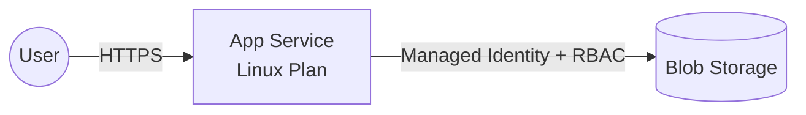

# Step 1: プロンプトで設計図を作る

このステップでは、「作りたいアプリケーションの要件」を GitHub Copilot Chat に渡して、**Azure 上のアーキテクチャ設計図 (Mermaid)** を生成します。

---

## 🛠 事前準備: リポジトリを Fork してクローンする

このハンズオンを始める前に、本リポジトリを自分の GitHub アカウントに Fork し、手元のパソコンにクローンしておきます。

### 1. GitHub でリポジトリを Fork する

1. ブラウザで本リポジトリのページを開きます。
2. 画面右上の **[Fork]** ボタンをクリックします。
3. Owner に自分のアカウントを選択し、**[Create fork]** をクリックします。
4. 自分のアカウント配下 (`https://github.com/<your-account>/<repo-name>`) に Fork されたことを確認します。

### 2. ローカル PC にクローンする

任意の作業ディレクトリで以下のコマンドを実行します (`<your-account>` と `<repo-name>` は自分の環境に合わせて置き換えてください)。

```powershell
# 作業用フォルダーへ移動 (例)
cd C:\Github

# Fork したリポジトリをクローン
git clone https://github.com/<your-account>/<repo-name>.git

# クローンしたフォルダーに移動
cd <repo-name>
```

### 3. VS Code で開く

```powershell
code .
```

> 💡 **Tip:** 以降の手順は、この Fork + クローンしたリポジトリをカレントディレクトリとして VS Code で開いている前提で進めます。GitHub Copilot / Copilot Chat 拡張機能が有効になっていることも確認してください。

---

## 🎯 このステップのゴール

- 要件を構造化してプロンプトにできる
- Copilot に **Mermaid 形式** のアーキテクチャ図を出力させられる
- 出力された設計図を **レビュー・修正** するコツがわかる

---

## 1. なぜ「設計図」から始めるのか

いきなり Bicep を書かせると、Copilot は「それっぽいけれど要件に合っていない」コードを生成しがちです。

- リソース間の依存関係が曖昧
- ネットワーク / ID / シークレット管理の方針がブレる
- 環境分離 (dev / prod) の考慮が抜ける

**先にアーキテクチャ図を生成し、人間がレビューして合意してから Bicep に落とす** ことで、成果物の品質が大きく安定します。これは AI を使う / 使わないに関わらず、IaC の鉄則です。

---

## 2. プロンプトの型

良いプロンプトは以下の 4 要素を含みます。

| 要素 | 例 |
|------|------|
| **役割 (Role)** | あなたは Azure ソリューションアーキテクトです |
| **コンテキスト (Context)** | 社内向けの小規模な Web アプリを Azure にデプロイしたい |
| **要件 (Requirements)** | App Service + Blob Storage / 東日本リージョン / dev・prod 分離 |
| **出力形式 (Output)** | Mermaid `flowchart LR` 形式 + 各リソースの役割説明 |

---

## 3. サンプルプロンプト

以下を **VS Code の Copilot Chat** にそのまま貼り付けて実行してみてください。

> 完全版は [`prompts/01-design.prompt.md`](../prompts/01-design.prompt.md) にあります。

````text
あなたは Azure ソリューションアーキテクトです。
以下の要件を満たす Web アプリケーション基盤の最小構成を設計してください。

# 要件
- 小規模な社内 Web アプリ (Node.js または .NET)
- ファイル保存用に Blob Storage を用意
- App Service から Blob Storage へは Managed Identity (System Assigned) + RBAC で接続 (パスワードレス)
- 本番 (prod) と開発 (dev) の 2 環境をパラメータで切り替えられるようにする
- リージョンは Japan East

# 非機能要件
- パスワードレス (Managed Identity + RBAC) を優先
- 最小権限の原則に従う
- Azure Well-Architected Framework の信頼性・セキュリティ・運用性を意識

# 出力形式
1. アーキテクチャ概要 (箇条書き 5 行以内)
2. Mermaid の `flowchart LR` 記法でアーキテクチャ図
3. 各リソースの役割と、採用した理由を表形式で
4. 想定されるリスクと対策を 3 点

# 成果物
上記 1～4 を 1 つの Markdown としてまとめ、`docs/architecture.md` に保存してください。
(ファイルが存在しない場合は新規作成、存在する場合は上書きしてください)

※ コード (Bicep) はまだ書かなくてよいです。設計のみ。
````

> 💡 **Tip:** Copilot Chat を **Agent モード** で使うと、この「`docs/architecture.md` に保存して」という指示がそのままファイル作成ツール呼び出しに変わり、自動でファイルが生成されます。Ask モードの場合は、出力された Markdown を手動でコピーして `docs/architecture.md` を作成・保存してください。

---

## 4. 期待される出力例

Copilot は以下のような Mermaid 図を返すはずです（揺らぎあり）。



VS Code で Mermaid をプレビューしたい場合は、Copilot Chat の回答から Mermaid コードブロックを開けば、レンダリングされた図が表示されます。

---

## 5. レビューのポイント

生成された図をそのまま採用せず、以下の観点でツッコミを入れてください。

- ✅ **ID**: App Service → Blob Storage の線は Managed Identity + RBAC になっているか？
- ✅ **シークレット**: 接続文字列・アカウントキーが図に直接出ていないか？ (→ Managed Identity 経由か？)
- ✅ **環境分離**: dev / prod の考慮はどこにあるか？ (パラメータか、別図か)
- ✅ **ネットワーク**: 要件に Private Endpoint / VNet 統合が必要か？ 今回は「最小構成」なので **あえて入れていない** ことを確認

違和感があれば、Copilot Chat に追質問します。

````text
App Service の Managed Identity から Blob Storage に接続するには、
どの RBAC ロール (例: Storage Blob Data Contributor) を割り当てれば良いですか？
また、App Service 側のアプリ設定例 (環境変数) も教えてください。
````

---

## 6. 設計図を「清書」する — Copilot に drawio を作らせる

Mermaid はレビュー・議論のスピードが速い一方、**Azure リソースの見た目が抽象的** で、ステークホルダーへの説明資料としては物足りないことがあります。

そこで、3 章で作成した `docs/architecture.md` の **Mermaid 図を Copilot Chat に貼り付けるだけ** で、Azure 公式アイコンを使った `docs/architecture.drawio` を生成してもらいます。

### 6-1. 環境準備 (1 回だけ)

`.drawio` を VS Code 上でプレビュー・編集できるように、以下の拡張機能を入れておきます。

- [Draw.io Integration](https://marketplace.visualstudio.com/items?itemName=hediet.vscode-drawio)

### 6-2. 手順

1. `docs/architecture.md` を開き、Mermaid コードブロック (` ```mermaid ... ``` `) を選択してコピーします。
2. Copilot Chat を **Agent モード** で開き、以下のプロンプトを貼り付けて実行します (`<ここに Mermaid を貼る>` の部分に、コピーした Mermaid ブロックをそのまま差し込んでください)。

````text
以下の Mermaid 図を、draw.io の図として清書し、
`docs/architecture.drawio` に保存してください。

```mermaid
<ここに docs/architecture.md からコピーした Mermaid を貼る>
```
````

3. 生成された `docs/architecture.drawio` を VS Code で開き、**Draw.io Integration 拡張のプレビュー** で図が正しく表示されるか確認します。
4. アイコンや配置が気になる場合は、Copilot Chat に日本語で追加指示を出します。例:

    - 「User は人型アイコンにして」
    - 「全体を Resource Group の枠で囲んで」
    - 「矢印のラベルに `HTTPS` と `Managed Identity + RBAC` を追加して」

> 💡 **Tip:** いきなり細かい要件を書かなくても大丈夫です。まずはシンプルなプロンプトで生成 → 気になるところを会話で直す、というやり方の方が Copilot との相性が良いです。

### 6-3. 完成イメージ (レイアウトのヒント)

```
┌─────────────── Resource Group: web-dev-rg ────────────────┐
│                                                            │
│   [User] ──HTTPS──► [App Service] ──MI+RBAC──► [Blob]      │
│                                                            │
└────────────────────────────────────────────────────────────┘
```

2 層 (左: 利用者 → 中央: 実行基盤 → 右: データ) に並べると、レビュー時の視線誘導がスムーズです。

---

## 7. 成果物

このステップを終えた時点で、以下 2 つのファイルがワークスペースに存在していることを確認してください。

| ファイル | 生成タイミング | 用途 |
|---|---|---|
| `docs/architecture.md` | 3 章のプロンプトを Agent モードで実行した際に自動生成 (Ask モードなら手動保存) | Mermaid 図 + リソース役割表の議論・差分管理用 |
| `docs/architecture.drawio` | 6 章の手順で作成 | draw.io で清書した資料用アーキテクチャ図 |

もし `docs/architecture.md` が作られていない場合は、Copilot Chat に以下を依頼してください。

````text
さっきの設計出力 (アーキテクチャ概要 / Mermaid / リソース表 / リスクと対策) を
`docs/architecture.md` として保存してください。
````

> 💡 **運用 Tips**: Mermaid は **"作業ドラフト"**、draw.io は **"成果物"** と役割分担すると、どちらも陳腐化しません。設計変更時はまず Mermaid (`docs/architecture.md`) を更新 → 合意後に draw.io に反映、という流れがスムーズです。

---

## 📚 参考: Azure 公式アイコンを手動で差し替える

Copilot が生成した `docs/architecture.drawio` は、汎用的な四角や円で表現されていることがあります。より丁寧に資料として仕上げたい場合は、**Azure 公式アイコン** に手動で差し替えてみてください。

> ℹ️ この手順は任意です。次の Step 2 に進むには必須ではありません。

### ① Azure アイコンライブラリを有効化する

1. VS Code で `docs/architecture.drawio` を開きます (Draw.io Integration が起動します)。
2. 左側のシェイプパネル一番下にある **「+ More Shapes...」** をクリックします。
3. ダイアログの **「Networking」** カテゴリーで以下にチェックを入れます。
    - ✅ **Azure** (古い 2D アイコン)
    - ✅ **Azure 2019** (新しいフラットアイコン。こちらを推奨)
4. **[Apply]** をクリック。左ペインに `Azure 2019` のグループが追加されます。

### ② 今回のリソースをアイコンに置き換える

既存の図形を選択 → 右クリック → **「Edit Style」** でスタイルを書き換える方法もありますが、一番簡単なのは **「新しいアイコンをドラッグして、古い図形と入れ替える」** 方法です。

本ハンズオンで登場する要素は、以下のアイコンに置き換えてください。

| 図の中の要素 | 検索キーワード (左ペインの検索ボックスに入力) | 使うアイコン |
|---|---|---|
| User (利用者) | `user` | **Azure 2019 → General → User** (人型アイコン)<br>※ 公式 Azure ステンシルに人型が無い場合は、組み込みの **General → Actor** で OK |
| App Service | `app service` | **Azure 2019 → Compute → App Services** (青い地球儀のマーク) |
| Blob Storage | `storage` | **Azure 2019 → Storage → Storage Accounts**<br>または **Azure 2019 → Storage → Blob Block** |
| Resource Group | `resource group` | **Azure 2019 → General → Resource Groups** (点線の枠アイコン)<br>※ 全体を囲む枠としては、組み込みの **"Container"** ツールで矩形を描き、ラベルに `Resource Group: web-dev-rg` と付ける方法でも可 |
| Managed Identity (矢印のラベル用) | `managed identity` | **Azure 2019 → Identity → Managed Identities** (補助アイコンとして矢印の近くに置くと分かりやすい) |

### ③ 置き換えの手順

1. 左ペインの検索ボックスにキーワード (例: `app service`) を入れて、目的のアイコンを探します。
2. アイコンをキャンバスの **空いている場所** にドラッグします。
3. 元の四角形 (`App Service` などのラベルが付いているもの) をクリックし、**ラベルのテキスト** (例: `App Service`) をコピーします。
4. 元の四角形を削除し、新しいアイコンにラベルを貼り付けます (アイコンをダブルクリックで編集可能)。
5. **矢印は再接続** が必要です。新しいアイコンの辺にカーソルを合わせると青い接続ポイント (×) が出るので、そこからドラッグして線を引き直します。
6. 矢印のラベル (`HTTPS` / `Managed Identity + RBAC`) は、矢印をダブルクリックすると編集できます。

### ④ 仕上げ

- Resource Group の枠は、全リソースを囲んだあと **右クリック → 「Edit Geometry」** でサイズを整えると綺麗です。
- アイコンのサイズは、選択後に **右パネルの「Size」** で全部 `48 x 48` などに揃えると統一感が出ます。
- 保存は `Ctrl + S` のみで OK。`.drawio` なので、git にコミットすれば差分レビューもできます。

> 💡 **Tip:** アイコン差し替えが面倒なときは、②の表を Copilot Chat に貼って「この対応表に従って `docs/architecture.drawio` のアイコンを差し替えて」と依頼すれば、Agent モードが自動で編集してくれます。

---

次のステップでは、この設計図を Copilot に渡して **Bicep** を生成させます。

👉 次へ: [Step 2: Bicep ファイルを作る](02-bicep.md)
